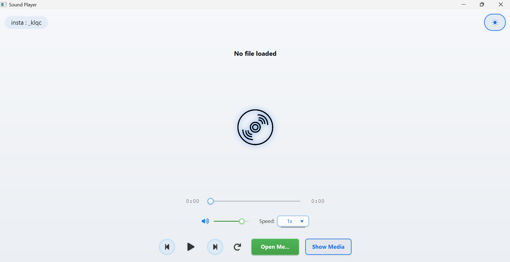
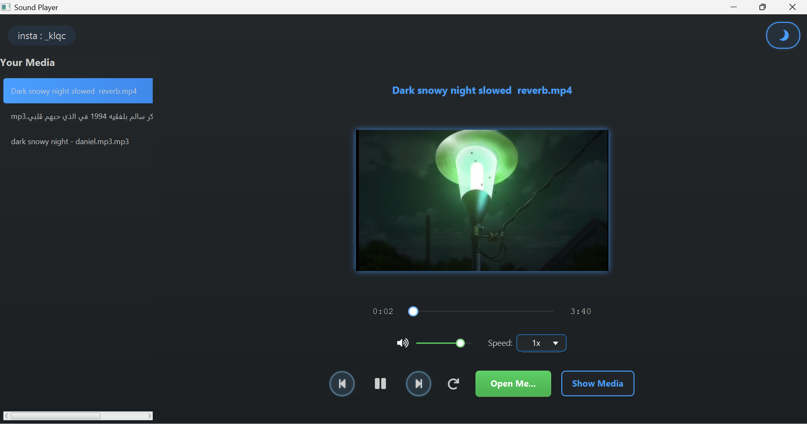
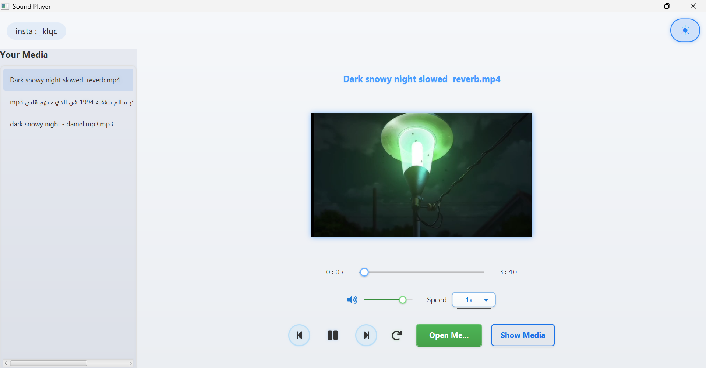

# 🎵 Sound Player V2


## Overview

A **modern multimedia player** built with JavaFX 21 that supports both audio and video playback! 🎬🎵 This professional-grade application combines elegant Material Design with powerful media features, offering a complete solution for managing and enjoying your media collection with an intuitive, theme-adaptive interface.



## ✨ Key Features

### 🎬 **Dual Media Support**
- **Audio Playback**: MP3, WAV, and other common audio formats
- **Video Playback**: MP4, AVI, MOV, MKV, WMV, FLV, WebM
- **Smart Detection**: Automatically switches between audio and video modes
- **Adaptive UI**: Dynamic container sizing for optimal viewing experience

### 🎨 **Modern Design System**
- **Dual Theme Support**: Professional dark and light themes
- **Material Design**: JFoenix components with smooth animations
- **FontAwesome Icons**: Modern vector icons throughout the interface
- **Responsive Layout**: Adapts to different window sizes and content types
- **Visual Feedback**: Hover effects, transitions, and loading animations

### 🎛️ **Advanced Playback Controls**
- **Variable Speed**: 0.5x, 1x, 1.5x, 2x playback speeds
- **Enhanced Seeking**: Lag-free progress slider with custom tooltips
- **Volume Control**: Smooth volume adjustment with visual feedback
- **Navigation**: Previous/Next with intelligent looping
- **Reset Function**: Quick restart to beginning

### 📋 **Smart Playlist Management**
- **Persistent Playlists**: Automatically saves and restores your playlist
- **Visual Indicators**: 📹 for videos, 🎵 for audio files
- **Quick Actions**: Delete items with animated buttons
- **Auto-Selection**: Currently playing track highlighted
- **Duplicate Prevention**: Smart file management

### 🎭 **Audio Visualization**
- **Animated Disk**: Spinning vinyl disk during audio playback (disk.png)
- **Speed-Synced Animation**: Disk rotation matches playback speed
- **Theme-Adaptive Effects**: Glowing effects that match your theme

### ⚙️ **Enhanced User Experience**
- **Theme Persistence**: Remembers your preferred theme
- **File Size Display**: Shows formatted file sizes
- **Error Handling**: Comprehensive error management with user feedback
- **Keyboard Support**: Full keyboard navigation support
- **Custom Tooltips**: Professional tooltip system

## 🖼️ Screenshots

### Dark Theme

*Professional dark theme with blue accents and glowing effects*

### Light Theme

*Clean light theme with modern Material Design elements*


## 📦 Installation

### Download Installer

Download the latest installer from the [Releases page](https://github.com/AhmedQw1/SoundPlayer/releases).

### Installation Steps

1. Run the downloaded `.exe` installer
2. Follow the installation prompts
3. Launch SoundPlayer from the desktop shortcut or Start menu

### System Requirements

- **OS**: Windows 10 or higher
- **RAM**: 4GB recommended (2GB minimum)
- **Storage**: 100MB free disk space
- **Runtime**: Java Runtime Environment (bundled with installer)
- **Additional**: Hardware acceleration recommended for video playback

## 🚀 Usage

### Quick Start Guide

1. **Launch** SoundPlayer from your desktop or Start menu
2. **Add Media**: Click "Open Media" to add audio or video files
3. **Control Playback**: Use the enhanced controls at the bottom
4. **Switch Themes**: Click the theme toggle button (🌙/☀) in the top-right
5. **Adjust Speed**: Use the speed dropdown for variable playback rates
6. **Navigate**: Use Previous/Next buttons or click items in the playlist

### Advanced Features

- **Theme Switching**: Toggle between dark and light themes instantly
- **Speed Control**: Adjust playback speed from 0.5x to 2x
- **Custom Tooltips**: Hover over sliders for precise value information
- **Playlist Management**: Right-click functionality for advanced operations
- **File Management**: Persistent playlist that remembers your media

## 🛠️ Building From Source

### Prerequisites

- **Java JDK 21** or higher
- **JavaFX 21** (included in dependencies)
- **Maven 3.8+** for building
- **WiX Toolset v3.14+** (for building Windows installer)

### Modern Dependencies

```xml
- JavaFX 21 (Controls, FXML, Media)
- JFoenix 9.0.10 (Material Design)
- Ikonli 12.3.1 (FontAwesome Icons)
- CSSFX 11.5.0 (Live CSS Reload)
```

### Build Instructions

```bash
# Clone the repository
git clone https://github.com/AhmedQw1/SoundPlayer.git
cd SoundPlayer

# Build the project
mvn clean package

# Run during development
mvn javafx:run

# Create installer (Windows)
./build_installer.bat
```

### Development Features

- **Live CSS Reload**: CSSFX enables real-time CSS updates
- **Module Support**: Full JPMS compliance
- **Modern Architecture**: Clean MVC-like controller separation

## 🏗️ Project Structure

```
SoundPlayerV2/
├── src/main/java/
│   ├── com/example/soundplayerv1/
│   │   └── SoundPlayerApplication.java    # Main application entry point
│   ├── Controller/
│   │   ├── MediaController.java           # Media playback logic
│   │   ├── MediaInfoController.java       # Media file information
│   │   ├── PlaylistController.java        # Playlist management
│   │   ├── SoundPlayerController.java     # Main UI controller
│   │   ├── ThemeController.java           # Theme switching
│   │   └── UIController.java              # UI component management
│   ├── model/
│   │   └── SoundFile.java                 # File model
│   ├── util/
│   │   └── TimeFormatter.java             # Time formatting utilities
│   └── module-info.java                   # JPMS module configuration
├── src/main/resources/
│   ├── com/example/soundplayerv1/
│   │   ├── css/
│   │   │   ├── dark/                      # Dark theme styles
│   │   │   │   ├── dark-theme.css
│   │   │   │   ├── dark-buttons.css
│   │   │   │   ├── dark-lists.css
│   │   │   │   ├── dark-sliders.css
│   │   │   │   └── video-style.css
│   │   │   ├── light/                     # Light theme styles
│   │   │   │   ├── light-theme.css
│   │   │   │   ├── light-buttons.css
│   │   │   │   ├── light-lists.css
│   │   │   │   ├── light-sliders.css
│   │   │   │   └── video-style.css
│   │   │   ├── animations.css             # Shared animations
│   │   │   ├── base.css                   # Base styles
│   │   │   ├── enhanced-buttons.css       # Enhanced button styling
│   │   │   ├── enhanced-progress.css      # Advanced slider styling
│   │   │   └── video-style.css            # Video component styling
│   │   ├── disk.png                       # Spinning disk image
│   │   └── SoundPlayer-view.fxml          # Main UI layout
│   └── META-INF/
│       └── MANIFEST.MF                    # JAR manifest
└── pom.xml                                # Maven configuration
```

## 🎯 Architecture

### Controller Architecture
- **`SoundPlayerController`**: Main UI controller and coordinator
- **`MediaController`**: Handles all media playback logic
- **`PlaylistController`**: Manages playlist operations and navigation
- **`ThemeController`**: Controls theme switching and persistence
- **`UIController`**: Manages UI components and interactions
- **`MediaInfoController`**: Handles media file information display

### CSS Theme System
The application features a sophisticated dual-theme system with modular CSS:

**Dark Theme Structure:**
```
css/dark/
├── dark-theme.css      # Master dark theme file
├── dark-buttons.css    # Dark button styling
├── dark-lists.css      # Dark playlist styling
├── dark-sliders.css    # Dark slider styling
└── video-style.css     # Dark video component styling
```

**Light Theme Structure:**
```
css/light/
├── light-theme.css     # Master light theme file
├── light-buttons.css   # Light button styling
├── light-lists.css     # Light playlist styling
├── light-sliders.css   # Light slider styling
└── video-style.css     # Light video component styling
```

**Shared Components:**
```
css/
├── base.css            # Foundation styles
├── animations.css      # Transitions and effects
├── enhanced-buttons.css # Advanced button effects
├── enhanced-progress.css # Advanced slider effects
└── video-style.css     # Base video styling
```

## 🎯 Roadmap

- [ ] **Equalizer**: Audio frequency adjustment
- [ ] **Visualizations**: Additional audio visualization modes
- [ ] **Playlist Export**: Save playlists to files
- [ ] **Subtitles**: Video subtitle support
- [ ] **Streaming**: Online media streaming capabilities
- [ ] **Plugins**: Extensible plugin architecture
- [ ] **Cross-Platform**: macOS and Linux support

## 🤝 Contributing

Contributions are welcome! Here's how you can help:

1. **Fork** the repository
2. **Create** a feature branch (`git checkout -b feature/amazing-feature`)
3. **Commit** your changes (`git commit -m 'Add amazing feature'`)
4. **Push** to the branch (`git push origin feature/amazing-feature`)
5. **Open** a Pull Request

### Development Guidelines
- Follow JavaFX best practices
- Maintain the existing architecture patterns
- Add appropriate CSS styling for both themes
- Include proper error handling
- Test on both Windows and other platforms when possible

## 📄 License

This project is currently **unspecified** for licensing. Please contact the maintainer for usage rights.

## 🙏 Acknowledgments

- **JavaFX Team** for the excellent framework
- **JFoenix** for Material Design components
- **Ikonli** for the beautiful icon system
- **FontAwesome** for the comprehensive icon library
- **CSSFX** for development-time CSS reloading

## 📞 Contact

- **Developer**: AhmedQw1
- **Instagram**: [@_klqc](https://instagram.com/_klqc)
- **GitHub**: [@AhmedQw1](https://github.com/AhmedQw1)

## 🔗 Other Projects

Check out my other work:
- [IBM Capstone](https://github.com/AhmedQw1/java-database-capstone)
- [University Chat App](https://github.com/AhmedQw1/uni-chat-app)
- [CV Web Portfolio](https://github.com/AhmedQw1/CV-Web-Portfolio)

---

**Last updated**: 2025-09-10 by AhmedQw1

*Built with ❤️ using JavaFX 21 and modern Java development practices*