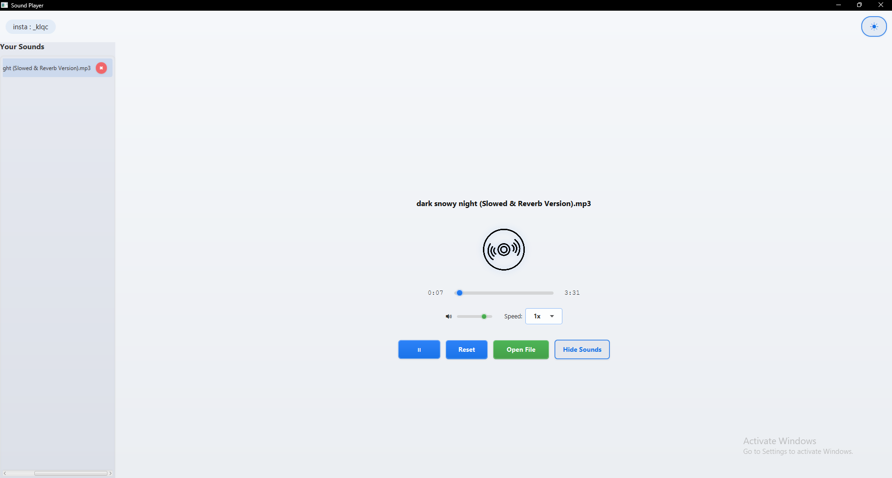

# 🎵 Sound Player


A modern, feature-rich audio player built with JavaFX that combines sleek design with powerful functionality.


## ✨ Features

- **🎛️ Intuitive Playback Controls** - Simple, responsive controls for your music
- **📋 Smart Playlist Management** - Create, edit, and save your playlists
- **🌓 Customizable Themes** - Toggle between light and dark modes
- **🔊 Advanced Audio Controls** - Adjust volume and playback speed
- **💾 Persistent Settings** - Your preferences are saved between sessions

### Dark Theme


### Light Theme


## 🚀 Quick Start

### Prerequisites
- Java 21 or higher
- Maven 3.8+

### Installation

```bash
# Clone the repository
git clone https://github.com/AhmedQw1/SoundPlayer.git

# Navigate to project directory
cd SoundPlayer

# Build the project
mvn clean package

# Run the application
java -jar target/soundplayer-1.0.jar
